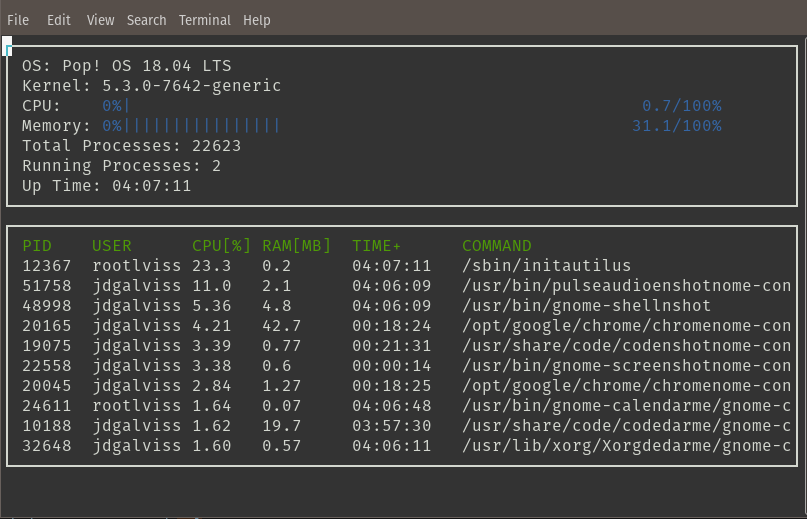

# System-Monitor
Implementation of a Linux System Monitor like [htop](https://github.com/htop-dev/htop) (but way less fancy) in C++.



## Instructions

1. Clone the project repository: 
    ```bash
    git clone https://github.com/jdgalviss/system-monitor.git
    cd system-monitor
    ```
2. Build the project: `make build`
    ```bash
    make build
    ```

3. Run the resulting executable:
    ```bash
    ./build/monitor
    ```